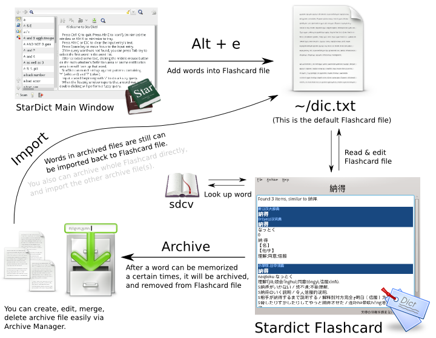

Stardict Flashcard
=================

.. image:: https://farm6.staticflickr.com/5586/15069695100_d934b4f6e9_c.jpg

Flashcard is a kind of great tool for learning foreign language. There has been some excellent cross-platform flashcard programs like `Anki
<http://ankisrs.net/>`_. However, all of them needs user to spend a lot of time to make flashcards. That's too awfully inconvenient.

*Stardict Flashcard* is here. Now you just need to have a word list, *Stardict Flashcard* will grab the explanations automatically via `sdcv
<http://sdcv.sourceforge.net/>`_:

	   
Never waste time for making flashcard files anymore ˊ・ω・ˋ 

Requirements
============

- `sdcv
  <http://sdcv.sourceforge.net/>`_
- Python3
- PyQt4
- make *(optional)*

Installation
============

    Installation is optional. You still can use *Stardict Flashcard* without installation: just excute ``./run``.

Clone this repository into a directory and ``cd`` in it, then:

::

   sudo make install

You can uninstall via:

::

   sudo make uninstall

Usage
=====

Add Words
---------

Add new word into Flashcard file within Stardict with ``Alt+e`` .
(The words will be added into ``~/dic.txt`` by default, that is just so-called **Flashcard file**)

After adding some word into Flashcard file, it's time to startup **Stardict Flashcard**:

Manipulate
----------

Press ``Space`` to display the answer of current word:

1. Then press ``Enter``  means you can recite this word.
2. ...Or if you can't think of the word and recite it, press ``Space`` to go on instead.

After a word can be recited up to 5 times (default), the word will be archived into current archive file automatically.

    Sometimes you may have added some wrong word, you can delete it from flashcard with ``Delete`` key.

Manage Archives
---------------

After finishing all words, you still can review them again by importing archive file back to Flashcard file.

You can create/rename/edit/merge/delete/import/... archive files in ``Archive => Manage``.

Contribution
============

Translation
-----------

You can translate this program on `Transifex
<https://www.transifex.com/projects/p/stardict-flashcard/>`_.

Or manully, clone the repo and use Qt Linguist or text editor to edit translation file:

1. The development packages of Python3-PyQt4 should be installed first.
2. Take ``ja_JP`` for example, create ``.ts`` file with ``pylupdate4 main.py -ts translate/ja_JP.ts``
3. Open the ``.ts`` file with Qt Linguist or text editor you like, begin to translate.
4. Compile the file into ``.qm`` with ``lrelease translate/ja_JP.ts``.
5. Execute ``run`` to take a look of translation. (You can set environment variable of ``LANG``, ``LANGUAGE`` to test)

License
=======

GPL v3
